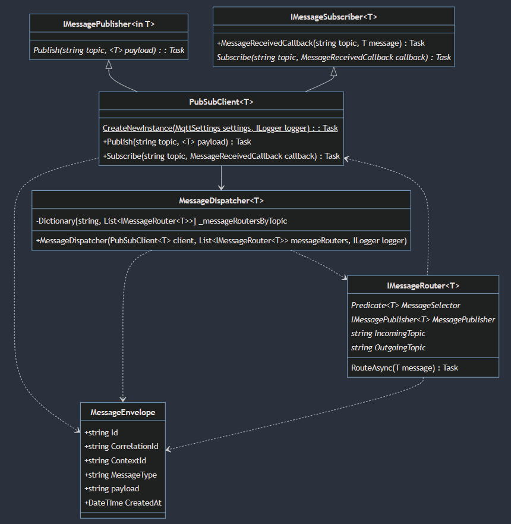
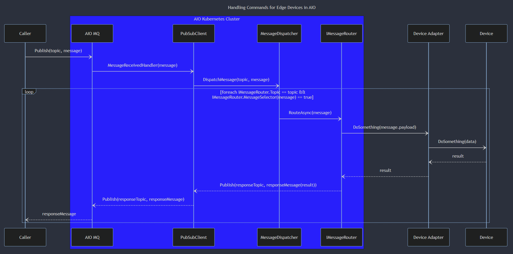

# Messaging Dispatcher Library Design Documentation

The transition from an edge strategy based around IoT Edge and IoT Hub to the new Azure IoT Operations leaves a range of gaps around edge based communications. This document will discuss the some of the key gaps around messaging patterns, and lays out a design to solve the gap around the most common of those patterns.
**NOTE**: This document is based on the Public Preview version of AIO. As the product evolves and particularly once it is release, this design will need to be revisited and modified based on the product evolution.

## Context

[Azure IoT Edge](https://learn.microsoft.com/en-us/azure/iot-edge/about-iot-edge?view=iotedge-1.4) offered a container based framework for running and managing workloads at the edge, the communication between them, and the communication with the cloud. It acts as a broker for local workload to workload communication, and uses the [three different messaging patterns](https://learn.microsoft.com/en-us/azure/iot-hub/iot-hub-devguide-c2d-guidance) supported by IoT Hub:

1. Direct Methods: Synchronous 2-way communication between the cloud and edge.
2. Cloud-to-Device Messages: Asynchronous 1-way communication from the cloud to the edge.
3. Device/Module Twins: Shared state expressed as JSON for configuring desired state and expressing current state.

Additionally, Azure IoT Edge offered a routing mechanism to handle moving messages between workloads at the edge and an SDK for accessing that functionality, as well as for using the three messaging patterns described above.

The shift to AIO fundamentally changes the architecture of the edge and with it the communication patterns it supports. Running at the edge in an Azure Arc enabled Kubernetes environment, AIO positions the MQTT protocol at the center of all communications at the edge and with the cloud. It offers a local MQTT broker, Azure MQ, that integrates with Azure Event Hubs (Kafka interface) and the new Azure Event Grid MQTT broker in order to move messages from the cloud to the edge and vice versa.

The current functionality in AIO is primarily focused on moving events from the edge to the cloud. Topics are forwarded to Event Hubs or Event Grid MQTT topics and from there can be processed using the standard mechanisms available in Azure. From the cloud to the edge, messages can be forwarded from designated Event Hubs and Event Grid MQTT topics,  however, once at the edge there is no SDK for interacting with the MQTT broker, nor built-in routing mechanisms for moving messages around from the broker to targeted workloads. In addition, the previously supported Direct Methods and Device/Module Twins patterns no longer exist.

## Edge to Cloud vs Cloud to Edge or Events vs Commands

Generally speaking, messages are classified as either events or commands (notifications are sometimes considered a third type, but for all intents and purposes these act as implicit commands). Events are expressed as past occurrences where commands refer to future occurrences. Events have no expectation of who will receive them or how they will be used. Commands typically have specific targets and carry with them expectations that they will be acted upon with confirmation of receipt and results.

Edge to Cloud communication is largely in the form of a constant flow of event such as device telemetry, workloads results and operational metrics. Communication from the Cloud to the Edge is largely in the form of commands. These commands can be explicit, in the form of a directive to specifically execute some function, or implicit in the form of expressing desired state with the expectation that when appropriate, the edge devices and/or workloads will change to this new state. In terms of IoT Edge and IoT Hub, the former is what patterns #1 (Direct Methods) and #2 (Device to Cloud) addressed, while the latter was handled by pattern #3 and Device/Module Twins.

## What Are We Trying to Solve

The problem we are trying to solve is the routing of messages, typically in the form of commands, at the edge from the MQTT broker out to the targeted workloads and returning responses back to the broker. Additionally, we want to provide a set of components that can simplify the move from an IoT Edge based solution to one based on AIO.

The design and solution will provide the following:

1. Guidance for how to handle commands being sent from the cloud to the edge. This will include guidance on message routing and sending responses.
2. Libraries and other code assets that can be used to implement solutions based on this guidance.
3. An abstraction from the underlying MQTT client libraries.

## Out of Scope

The following are not goals of the current design:

1. Providing specific guidance for edge to cloud communication. Gaps around this scenario, such as optimizing messages flows (e.g. scheduling, batching, compression, etc.) or persisting messages in the case of extended interruption of communication with the cloud will be addressed in other designs.
2. Design for high scale scenarios. The current working assumption with AIO is that there will be multiple K8s clusters, each running their own instance of AIO, dedicated to some subset of lines in a factory. Furthermore, given the fact that Cloud to Edge messages should be exponentially fewer than the event flow from the Edge to the Cloud, this should naturally keep the scale requirements low. Should either of these assumptions change, the design will need to be revisited and modified accordingly.
3. Design for high performance scenarios. Performance needs to be more rigorously defined on a scenario by scenario basis, but generally in messaging systems we are trading the latency of asynchronous communication for reliability, scaling and other advantages inherent in queueing and topic based solutions. Synchronous communication patterns such as the IoT Hub Direct Method capabilities are beyond the scope of this design and will be addressed in future designs.
4. Addressing scenarios around configuring the edge runtime, edge workloads or edge devices. There are alternate mechanisms provided by the AIO architecture, such as Symphony, that can potentially be leveraged to solve these scenarios. Until these alternatives are assessed, this design will not attempt to address these scenarios.

## Design

This design consists of the following components:

1. PubSubClient - this wraps the underlying MQTT client library. There is a generic version for complex types and string based version for primitive types. Each offers two abstractions:
   - IMessageSubscriber - subscribe to a topic and provide a callback for messages received
   - IMessagePublisher - publish a message to a topic
2. CommandDispatcher - this takes a list of ICommandRouters, subscribes to their topics and then forwards messages to the appropriate CommandRouter.
3. ICommandRouter - Implementors provide a topic name, selector predicate (optional for fine grained filtering) and whatever functionality needed in the RouteAsync() to forward the message to the appropriate destination. Additionally, the CommandRouter will have a reference to an IMessagePublisher so that any responses can be published. It uses a generic implementation so it can be used with any message envelope or even with no envelope.
Optional:
4. MessageEnvelope - This is an optional envelope that can be used throughout the distributed message flow to standardize metadata.

The following class diagram gives a more detailed look at these components:

## Message Flow

## Runtime Options

In AIO, the general runtime hosting model is to deploy workloads inside Docker containers run in a Kubernetes environment. This messaging library can be used in a few different ways within this model:

1. Incorporated as a set of libraries into an existing workload that will be deployed as a container. This makes sense if the following are true:
   - We control the code and are willing to extend it
   - The workload can interact directly with MQTT
2. Run as a standalone workload in its own container. This will be desirable in the following circumstances:
   - We do not control the code or cannot modify it
   - The workload uses some protocol other than MQTT such as HTTP for communication
